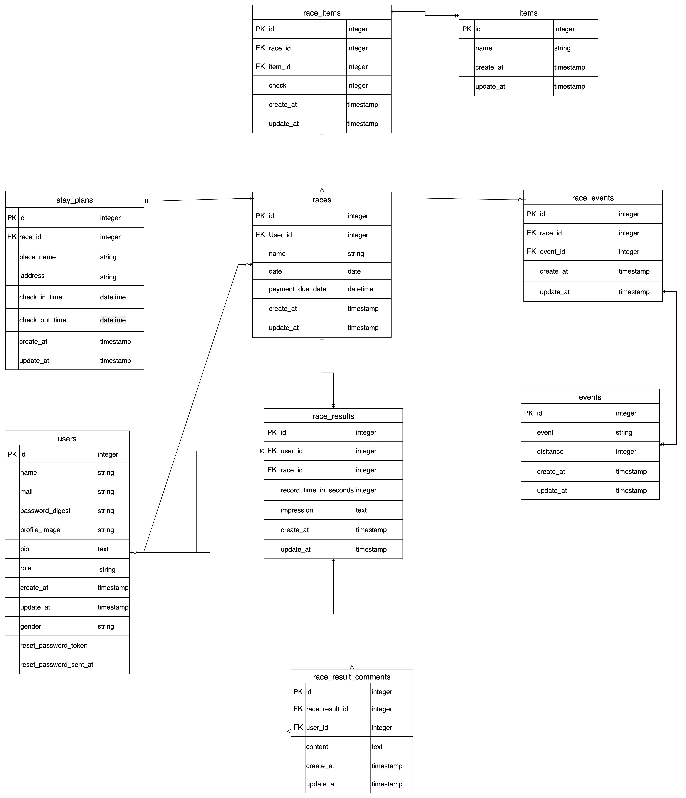

## サービス名
**RunChronicle**

## 目次
- [サービス概要](#サービス概要)
- [サービスURL](#サービスURL)
- [サービス開発の背景](#サービス開発の背景)
- [機能紹介](#機能紹介)
- [技術構成について](#技術構成について)
- [ER図](#ER図)
- [画面遷移図](#画面遷移図)

---

## サービス概要
市民ランナーのためのTo Do アプリです。
大会のエントリー〜当日までにやるべきことを整理、準備することをリスト化して大会までの準備をスムーズにするためのサポートをいたします。

## サービスURL
https://runchronicle.jp

## サービス開発の背景
市民ランナーが大会に出るまでにはやるべきことがたくさんありますが、普段の生活で忙しく準備に十分な時間を確保することができません。
私自身も市民ランナーとして、仕事やに追われる中で練習やエントリー準備に時間を割くことの難しさを感じています。
また、大会出場の経験が少ない初心者はそもそもどんな準備が必要かもわからないことが多いです。
その結果、入金を忘れてエントリーが完了していなかったりなど、大会本番まで準備をしたにもかかわらず、
出走することができず残念な思いをする知人もいました。

RunChronicleは、こうしたトラブルを防ぎ、安心して大会当日を迎えるためのサポートを目指しています。

## 機能紹介
### 🏃‍♂️ 大会管理機能
- **大会投稿機能**: 参加予定の大会情報を登録・管理
- **宿泊先投稿機能**: 遠征時の宿泊先情報を記録
- **大会結果投稿機能**: レース結果とタイムを記録

### 📊 コミュニティ機能
- **みんなの大会結果機能**: 他のランナーの結果を参考に

## 技術構成について
| カテゴリ | 技術内容 |
|:-------|:--------:|
| サーバーサイド     | Ruby on Rails 7.2.2.1・Ruby "3.3.6"        |
| フロントエンド      | Ruby on Rails        |
| CSSフレームワーク      | TailwindCSS        |
|データベースサーバー    | PostgreSQL        |
| アプリケーションサーバー      | Render        |
| バージョン管理ツール    | GitHub・Git Flow       |
| 認証機能    | Devise      |

## ER図

## 画面遷移図
https://www.figma.com/design/W9JCJLc7KaJOws4bkUZ9Kz/%E5%8D%92%E5%88%B6%E3%82%A2%E3%83%97%E3%83%AA%E7%94%BB%E9%9D%A2%E9%81%B7%E7%A7%BB%E5%9B%B3?node-id=0-1&t=Mm5NeakA1Wvw6EX8-0